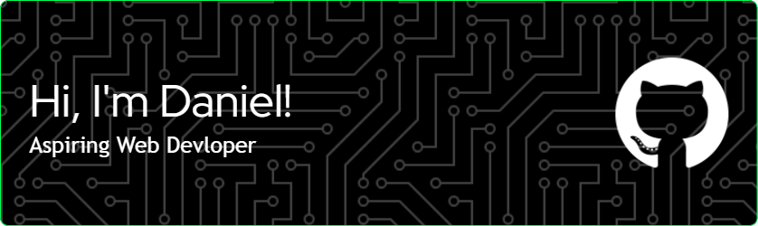

<h2 align="left">👋 Hi there! A little bit about me...</h2>

###

DevOps Administrator transitioning to Front-End and Full-Stack Web Development. With a solid foundation in AWS, I am continually enhancing my skills in web, mobile, and API development. My journey from infrastructure management to building engaging user experiences motivates me to push the boundaries of what I can create.

###

<h2 align="left">🛠️ Technologies & Tools I've Worked With</h2>

###

  
  
  
  
  
  
  
  
  
  
  
  
  
  
  
  
  
  
  
  
  
  
  
  
  
  
  

###

  
  

###
